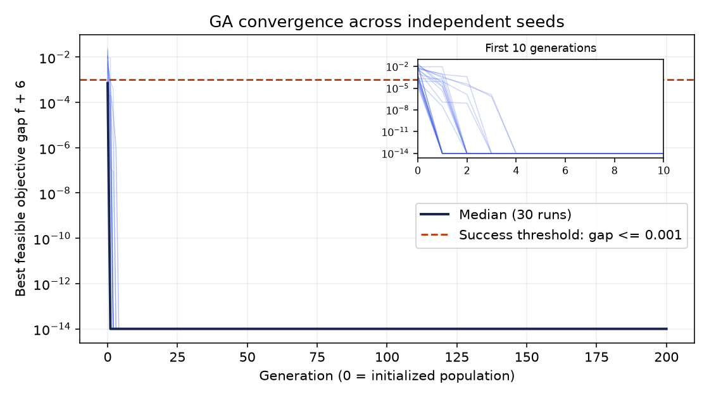
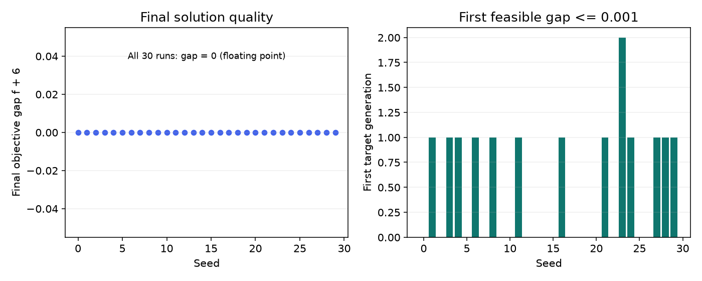

# 基于人工智能的优化问题求解

人工智能基础课程作业 v0.1：从零实现混合编码遗传算法（GA），求解含五个二进制变量和两个连续变量的原题。
交付包含可运行代码、独立参考验证、30 次实际实验、收敛图和统计数据。本轮仅做初步实验与推送，技术报告暂缓。
公开仓库：https://github.com/Fallen-Crystal/ai-foundations-optimization

## 题目

$$
\min_{\mathbf u,\mathbf v}\quad f(\mathbf u,\mathbf v)
=\sum_{i=1}^{5}(u_i^2-3u_i)+2\sum_{k=1}^{2}v_k^2-4v_1v_2
$$

$$
\begin{aligned}
\sum_{i=1}^{5}u_i&\le3,\\
2v_1-1.2v_2&\ge1,\\
u_2v_1+u_4v_2&=2.2,\\
u_i&\in\{0,1\},\quad i=1,\ldots,5,\\
1\le v_1&\le4,\qquad0\le v_2\le3.5.
\end{aligned}
$$

## 方法

染色体为 `[u1,u2,u3,u4,u5,v1,v2]`。前五位为二进制，后两位为实数。
使用规模为 3 的锦标赛选择，保留 2 个精英；二进制部分做均匀交叉，
连续部分做逐坐标算术交叉；分别用 bit-flip 和高斯变异探索。

修复先保证 `u2`、`u4` 至少有一个为 1，再随机清除超出基数上限的 1，始终保留至少一个等式系数。
当 `(u2,u4)=(1,0)` 时设 `v1=2.2`；当为 `(0,1)` 时设 `v2=2.2`；
当为 `(1,1)` 时令 `t=clip((v1-v2+2.2)/2,1,2.2)`，再设 `v=(t,2.2-t)`，
一次投影同时满足等式和变量边界。剩余不等式违反量进入平方罚项。

选择分数为 `objective + 100 * sum(residuals**2)`；残差包括基数、不等式、等式、边界及二进制约束。
输出单独维护历史最优可行解，所有残差不超过 `1e-08` 才标记可行。
GA 不调用参考求解器、不预置最优点；修复中固定 2.2 是满足原等式所必需的赋值。

## 环境与安装

支持目标为 Python 3.11+；本轮实际验证 Python 3.12.13，未单独验证 Python 3.11。
依赖仅 NumPy、pandas、matplotlib、pytest；参考求解使用代数与枚举，不需要 SciPy 或商业求解器。

```bash
git clone https://github.com/Fallen-Crystal/ai-foundations-optimization.git
cd ai-foundations-optimization
python3 -m venv .venv
source .venv/bin/activate
python -m pip install -r requirements.txt
python scripts/run_once.py
```

复现本轮已安装的依赖版本可使用 `python -m pip install -r requirements-lock.txt`。
锁定表仅列项目依赖及其传递依赖，不含修订运行手册所用的 PDF 工具。

## 快速运行与实验复现

以下命令从仓库根目录执行：

```bash
python -m src.reference_solver
python scripts/run_once.py --seed 0
pytest -q
python scripts/run_experiments.py
python scripts/make_figures.py
python scripts/update_readme.py
```

`run_experiments.py` 默认实际运行 seed 0..29，覆盖结果 CSV 和元数据；每个种子执行完整 200 代，不提前终止。
`make_figures.py` 和 `update_readme.py` 读取保存的数据，重新生成图和 README。
固定 seed 的染色体和历史可复现；计时受机器负载影响，不要求逐次一致。

## 实际结果

成功定义：可行且 `abs(f+6)<=1e-3`。以下表格由 `data/results/summary.csv` 和 `raw_runs.csv` 自动生成。

| 指标 | 实测值 |
|---|---:|
| 独立随机种子数 | 30 |
| 可行运行数 | 30 |
| 成功率 | 100.0% |
| 目标值均值 | -6 |
| 目标值样本标准差（ddof=1） | 0 |
| 最好 / 最坏目标值 | -6 / -6 |
| 平均运行时间（秒） | 0.241252 |
| 首次达到阈值的平均代数 | 0.467 |
| 初始化即达到阈值的运行数 | 17 |
| 首次达到阈值的代数范围 | 0–2 |

初始化标为第 0 代；有 17 次在初始化已达到成功阈值，因此该结果不能用于证明 GA 优于其他算法。
目标值显示为 -6 是本轮浮点计算结果；理论全局最优由独立分析与枚举验证。
运行时间为本机算法调用耗时，不含安装、绘图、文档生成或网络操作。




## 仓库结构

- `src/problem.py`：目标函数、约束残差、可行性与修复。
- `src/ga.py`：遗传算法，显式局部随机数生成器。
- `src/reference_solver.py`：枚举 32 种二进制配置，解析求各配置连续最优解。
- `configs/baseline.json`：完整实验参数。
- `scripts/`：单次运行、重复实验、绘图与文档生成入口。
- `tests/`：已知点、残差、修复、参考最优值和随机种子复现检查。
- `data/results/`：原始结果、每代历史、统计、参考枚举和环境元数据。
- `artifacts/figures/`：收敛与 30 次运行结果图。
- `docs/`：GitHub 验证、手册更正、会话状态和后续事项。

## 提交前补充

本轮模型配置按用户要求记录为 GPT-6.1 sol / Medium，不由算法脚本切换。
技术报告按用户最新要求暂不撰写；后续正式提交前再根据课程给定模板编写。
作者、学号、班级和联系方式由提交者填写。Contact：`[请填写姓名及邮箱]`。
